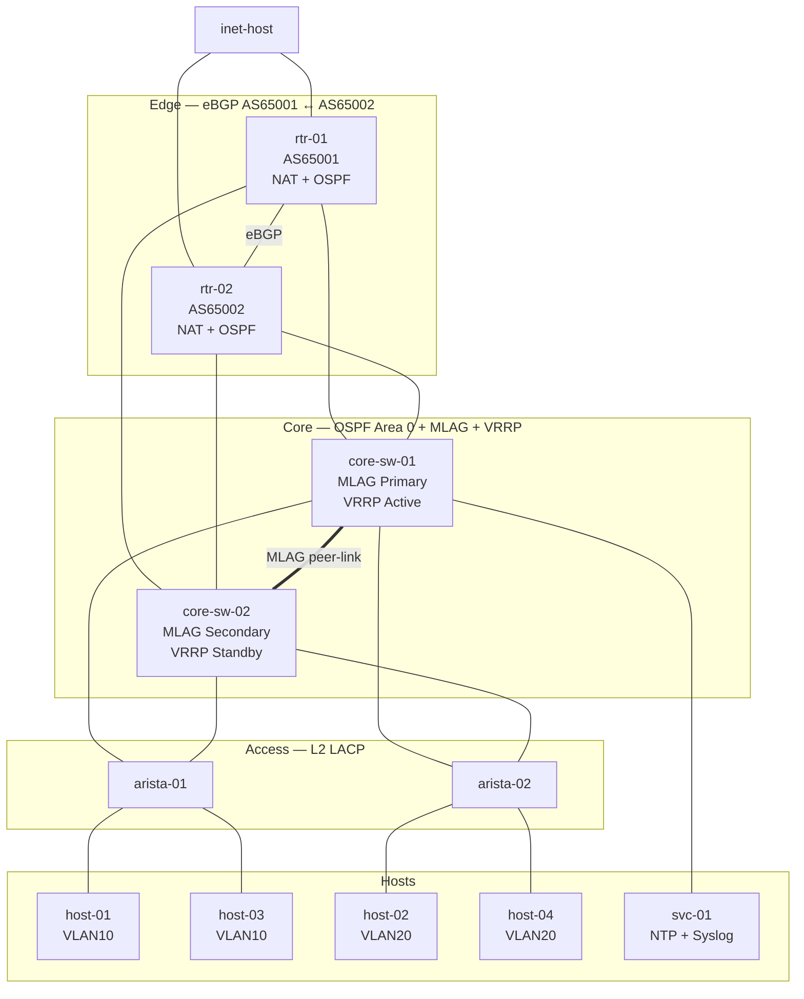

# Enterprise Network Automation Platform

A network automation platform built on a multi-vendor containerized lab.
Automates the full configuration lifecycle — deployment, validation, drift
detection, and rollback — across a 3-tier enterprise topology. Includes an
AI-assisted network operations layer backed by a custom FastMCP server.

---

## Topology


---

## Stack

| Layer | Tool | Role |
|-------|------|------|
| Lab | Containerlab | Multi-vendor virtual topology |
| Source of truth | hosts.yaml | Per-device automation data |
| Automation | Nornir + Scrapli | SSH config deployment |
| Rendering | Jinja2 | Vendor-specific templates |
| Validation | pyATS + Genie | Pre/post state verification + intent validation |
| Drift | DeepDiff | Intended vs actual config comparison |
| Rollback | rollback.py | Config restore on post-check failure |
| Telemetry | Prometheus + Grafana | Metrics and dashboards |
| Observability | SNMP + gNMI | Device metrics (gNMI: Arista only) |
| CI/CD | GitLab | 5-stage automated pipeline with remediation |
| Linux hosts | Ansible | NTP server, syslog receiver on svc-01 |
| AI | FastMCP + LangChain + Ollama | Natural language network state queries |

---

## Lab Nodes

| Node | Image | Role | Details |
|------|-------|------|---------|
| rtr-01 | cisco_c8000v:17.15.04c | Edge router | AS65001, NAT, OSPF |
| rtr-02 | cisco_c8000v:17.15.04c | Edge router | AS65002, NAT, OSPF |
| core-sw-01 | ceos:4.35.1F | Core switch | MLAG primary, VRRP active |
| core-sw-02 | ceos:4.35.1F | Core switch | MLAG secondary, VRRP standby |
| arista-01 | ceos:4.35.1F | Access switch | LACP uplinks, VLAN 10 hosts |
| arista-02 | ceos:4.35.1F | Access switch | LACP uplinks, VLAN 20 hosts |
| svc-01 | netshoot | Services host | NTP, syslog receiver |
| inet-host | netshoot | Internet simulation | Dual-homed to both routers |
| host-01/03 | netshoot | End hosts | VLAN 10 |
| host-02/04 | netshoot | End hosts | VLAN 20 |

Management network: `172.20.20.0/24`

---

## Addressing

**Management network: `172.20.20.0/24`**

| Node | Management IP |
|------|--------------|
| rtr-01 | 172.20.20.11 |
| rtr-02 | 172.20.20.12 |
| arista-01 | 172.20.20.13 |
| arista-02 | 172.20.20.14 |
| core-sw-01 | 172.20.20.15 |
| core-sw-02 | 172.20.20.16 |
| svc-01 | 172.20.20.20 |
| inet-host | 172.20.20.30 |
| host-01 | 172.20.20.21 |
| host-02 | 172.20.20.22 |
| host-03 | 172.20.20.23 |
| host-04 | 172.20.20.24 |

**Data plane**

| Link | Subnet |
|------|--------|
| eBGP rtr-01 ↔ rtr-02 | 10.0.0.0/30 |
| rtr-01 → core-sw-01 | 10.1.0.0/30 |
| rtr-01 → core-sw-02 | 10.1.0.4/30 |
| rtr-02 → core-sw-01 | 10.2.0.0/30 |
| rtr-02 → core-sw-02 | 10.2.0.4/30 |
| rtr-01 → inet-host | 203.0.113.0/30 |
| rtr-02 → inet-host | 203.0.113.4/30 |
| VLAN 10 (users) | 10.10.10.0/24, VIP 10.10.10.1 |
| VLAN 20 (servers) | 10.20.20.0/24, VIP 10.20.20.1 |
| VLAN 99 (management) | 10.99.99.0/24, VIP 10.99.99.1 |

---

## What Gets Deployed

Every workflow is idempotent with pre/post validation and automatic rollback.

| Domain | Components |
|--------|-----------|
| Routing | eBGP, OSPF area 0, NAT overload, BGP prefix policy, static routes |
| Switching | VLANs, MLAG, LACP port-channels, VRRP |
| Services | NTP, syslog, SNMP, SSH hardening |

---

## CI/CD Pipeline

Five stages run on every push via GitLab CI/CD, mirrored to GitHub.
```
build → prevalidation → deploy (manual gate) → postvalidation → remediation (manual gate)
```

- **build** — environment, dependencies, device reachability, inventory
- **prevalidation** — BGP, OSPF, and connectivity baselines captured before deploy
- **deploy** — full stack in dependency order, requires manual approval
- **postvalidation** — 8 parallel jobs: BGP state, full intent validation suite, connectivity
- **remediation** — switching domain restore with connectivity recheck (manual gate)

---

## Running the Lab

### Prerequisites
```bash
docker pull vrnetlab/cisco_c8000v:17.15.04c
docker pull ceos:4.35.1F
docker pull nicolaka/netshoot:latest
```

### Startup sequence
```bash
# 1. NetBox
cd netbox-docker && docker compose up -d

# 2. Telemetry stack
cd telemetry && docker compose up -d

# 3. Lab topology — wait ~5 min for IOS XE to boot
cd containerlab && sudo containerlab deploy -t topology.yml

# 4. Activate environment
cd .. && source venv/bin/activate
set -a && source .env && set +a

# 5. Deploy full stack
python automation/runner.py connect test
python automation/runner.py deploy interfaces
python automation/runner.py deploy ospf
python automation/runner.py deploy nat
python automation/runner.py deploy bgp
python automation/runner.py deploy bgp-policy
python automation/runner.py deploy vlans
python automation/runner.py deploy portchannels
python automation/runner.py deploy mlag
python automation/runner.py deploy vrrp
python automation/runner.py deploy ntp
python automation/runner.py deploy syslog
python automation/runner.py deploy snmp
python automation/runner.py deploy ssh
```

> **Note:** Cisco c8000v does not persist config across restarts.
> Arista cEOS does. Run the full deploy sequence after every lab restart.
>
> Containerlab injects a management default route on cEOS nodes at AD 1.
> Internet reachability uses specific static routes toward inet-host subnets
> deployed via the OSPF workflow. Longest-prefix match bypasses the
> management default without modifying the container network stack.

---

## Validation

### Connectivity and inventory
```bash
pyats run job tests/postcheck/test_connectivity.py --testbed tests/testbed.yaml
python automation/runner.py validate inventory
python automation/runner.py validate netbox
```

### BGP state
```bash
pyats run job tests/precheck/test_bgp.py --testbed tests/testbed.yaml
pyats run job tests/postcheck/test_bgp.py --testbed tests/testbed.yaml
```

### OSPF baseline
```bash
pyats run job tests/precheck/test_ospf.py --testbed tests/testbed.yaml
```

### Intent validation
```bash
# BGP — advertised prefix policy compliance
pyats run job tests/postcheck/test_bgp_intent.py --testbed tests/testbed.yaml

# BGP — received prefix compliance
pyats run job tests/postcheck/test_bgp_received_intent.py --testbed tests/testbed.yaml

# OSPF — neighbor FULL state + loopback convergence
pyats run job tests/postcheck/test_ospf_intent.py --testbed tests/testbed.yaml

# VRRP — Master/Backup state + virtual IP
pyats run job tests/postcheck/test_vrrp_intent.py --testbed tests/testbed.yaml

# MLAG — domain state + interface active-full
pyats run job tests/postcheck/test_mlag_intent.py --testbed tests/testbed.yaml

# NTP — sync state + server match
pyats run job tests/postcheck/test_ntp_intent.py --testbed tests/testbed.yaml
```

### End-to-end connectivity
```bash
docker exec clab-enterprise-netauto-lab-host-01 ping -c 3 10.20.20.10
docker exec clab-enterprise-netauto-lab-host-01 ping -c 3 203.0.113.1
```

### Drift detection
```bash
python automation/runner.py drift bgp
```

---

## AI Layer

Natural language network state queries via a custom FastMCP server and
LangChain ReAct agent backed by a local Ollama LLM.

### Starting the AI layer
```bash
# Terminal 1 — MCP server
source venv/bin/activate
set -a && source .env && set +a
python ai/mcp_server.py

# Terminal 2 — Agent
source venv/bin/activate
set -a && source .env && set +a
python ai/agents/agent.py
```

### Example queries
```
What devices are in the inventory?
What is the BGP state on rtr-01?
What are the OSPF neighbors of core-sw-01?
```

### Available tools
| Tool | Description |
|------|-------------|
| get_device_inventory | List all devices with role and IP from hosts.yaml |
| get_bgp_state | Live BGP neighbor state and prefix counts |
| get_ospf_neighbors | Live OSPF neighbor state |

> All tools are read-only. The AI layer has no config-changing capability.

---

## Environment

- WSL Ubuntu 24.04
- Python 3.12 (`./venv`)
- Docker with Compose V2
- Containerlab v0.73+
- Ollama with llama3.1:8b